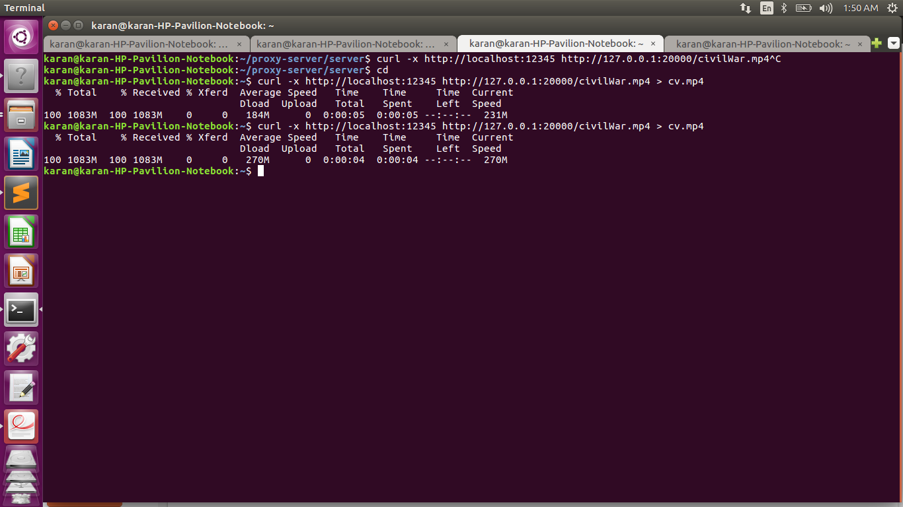
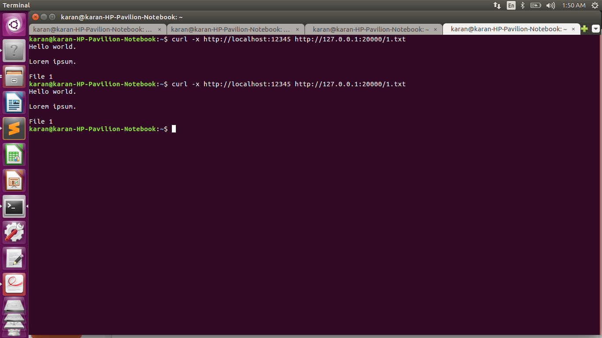

# HTTP Proxy Server
This is a basic HTTP web proxy server that understands only GET requests and can cache web pages.  

<br><br>


## What is a proxy Server
Generally, when a client makes a request, the request is sent to
the web server. The web server then processes the request and sends back a response
message to the requesting client.  
In order to improve the performance we create​ a proxy server between the client and the web
server​. A web proxy is a program that acts as an intermediary between a web client and a web server.  
Now, both the request message sent by the client and the response message delivered by the
web server pass through the proxy server.
In other words, the client requests the objects via the proxy server. The proxy server will forward
the client’s request to the web server. The web server will then generate a response message
and deliver it to the proxy server, which in turn sends it to the client.

## Starting Servers
```
python proxy.py
cd server/
python sever.py
```

## Curl Requests
```
curl -x http://localhost:12345 http://127.0.0.1:20000/<filename>
```

## Libraries Used
- os
- socket
- time
- thread

## Features Implemented
- Caching using the "If Modified Since" header
- Caching depends on Cache-Control header
- Cached data stored in python dictionary
- Cache Size: 3
- Non blocking server, i.e., can process multiple requests concurrently.
